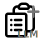

#  Copy File Content Plugin

## Description
<!-- Plugin description -->
Copy File Content is a plugin that enhances your workflow by allowing you to quickly copy the contents of selected files and directories to the clipboard, formatted according to customizable settings.
<!-- Plugin description end -->

  This plugin is based on the mwguerra's [Copy File Content](https://github.com/mwguerra/copy-file-content) plugin.

